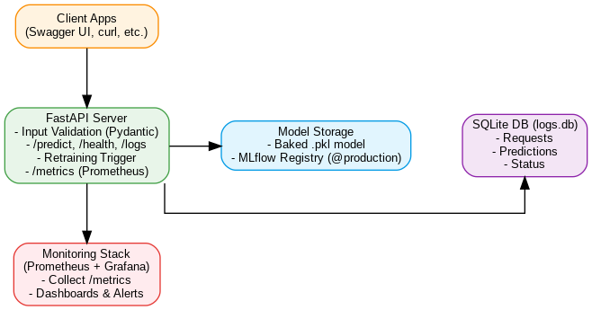

# Iris Classifier API

FastAPI-based ML inference service for Iris species prediction with **MLflow integration**, **SQLite logging**, and **Prometheus/Grafana monitoring**.

---

## 🏗️ Architecture

The service predicts Iris species via a FastAPI API, logs requests to SQLite, and exposes Prometheus metrics that Grafana visualizes.



---

## 📂 Folder Structure (important only)

mlops-iris/
├── app.py                # FastAPI prediction API
├── README.md             # Project documentation
├── baked_models/         # Pre-trained model(s) & metadata
│   ├── iris_best.pkl
│   └── metadata.json
├── artifacts/            # Evaluation outputs (reports/plots)
│   ├── logistic_regression/
│   └── random_forest/
├── data/                 # Datasets
│   ├── iris.csv
│   ├── raw/
│   └── processed/
├── monitoring-stack/     # Prometheus & Grafana stack
│   ├── docker-compose.yml
│   ├── prometheus.yml
│   ├── grafana-dashboard-iris.json
│   └── grafana/          # provisioning & dashboards
├── src/                  # Training & pipeline code
│   ├── train_models.py
│   └── utils/
│       └── load_data.py
├── docs/                 # Diagrams & docs
│   └── iris_architecture_graphviz.png
└── .github/workflows/    # CI/CD
    └── main.yml

---

## 🚀 Quickstart

```bash
# 1) Start API (example: baked model path)
uvicorn app:app --host 0.0.0.0 --port 8000

# or with Docker
docker run -d --name iris-predictor-app -p 8000:8000 ^
  -e PICKLE_PATH=baked_models/iris_best.pkl ^
  -v %CD%/baked_models:/app/baked_models ^
  amitk2501/iris-predictor-app:latest

# 2) Open Swagger
http://localhost:8000/docs
```

**Monitoring stack (Compose):**
```bash
cd monitoring-stack
docker compose up -d
# Prometheus: http://localhost:9090
# Grafana   : http://localhost:3000 (admin/admin)
```

---

## 📡 Endpoints

| Method | Path         | Purpose                                  |
|-------:|--------------|------------------------------------------|
| GET    | `/health`    | Service status & model info              |
| POST   | `/predict`   | Predict Iris class from 4 features       |
| GET    | `/logs`      | Last 100 prediction logs (JSON)          |
| GET    | `/logs.csv`  | Download logs as CSV                     |
| GET    | `/logs.db`   | Download raw SQLite DB                   |
| DELETE | `/logs`      | Clear all logs                           |
| POST   | `/retrain`   | Trigger training script                  |
| POST   | `/ingest-json` | Ingest labeled rows (JSON)            |
| POST   | `/ingest-csv`  | Ingest labeled rows (CSV)             |
| POST   | `/retrain-on-staged` | Retrain using staged data       |
| GET    | `/metrics`   | Prometheus metrics (visible in Swagger)  |

---

## ✅ Validation & Monitoring

- **Pydantic constraints** on all inputs (0 < value < 10), plus cross-field checks
- **Prometheus metrics**: request counts, latency histogram, model-loaded gauge
- **Grafana dashboard**: p50/p90/p99 latency, requests by status/model

---

## 🧪 Sample Request

```bash
curl -X POST "http://localhost:8000/predict" \
  -H "Content-Type: application/json" \
  -d "{\"sepal_length\": 5.1, \"sepal_width\": 3.5, \"petal_length\": 1.4, \"petal_width\": 0.2}"
```

---

## 🔐 Notes

- Protect `/retrain*` routes behind auth if exposed publicly
- If using MLflow: ensure `MODEL_URI` or `MODEL_NAME` + `@production` is available
- For CSV uploads, install `python-multipart` or use the raw-body variant

---

*Generated on 2025-08-10 01:55*
