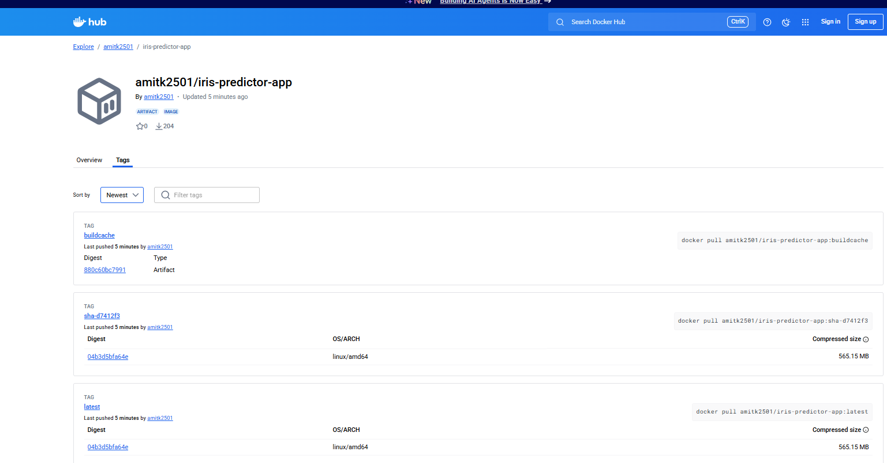

# 🏗️ Iris Classifier MLOps Project

The service predicts Iris species via a FastAPI API, logs requests to SQLite, and exposes Prometheus metrics that Grafana visualizes.

## 🖼️ Architecture


---

## 📂 Folder Structure (important only)

```text
mlops-iris/
├── app.py                      # FastAPI prediction API
├── README.md                   # Project documentation
├── baked_models/                # Pre-trained model(s) & metadata
│   ├── iris_best.pkl
│   └── metadata.json
├── artifacts/                   # Evaluation outputs (reports/plots)
│   ├── logistic_regression/
│   └── random_forest/
├── data/                        # Datasets
│   ├── iris.csv
│   ├── raw/
│   └── processed/
├── monitoring-stack/            # Prometheus & Grafana stack
│   ├── docker-compose.yml
│   ├── prometheus.yml
│   ├── grafana-dashboard-iris.json
│   └── grafana/                  # provisioning & dashboards
├── src/                         # Training & pipeline code
│   ├── train_models.py
│   └── utils/
│       └── load_data.py
├── docs/                        # Diagrams & docs
│   └── iris_architecture_graphviz.png
└── .github/workflows/           # CI/CD
    └── main.yml
```

---

## 🚀 Quick Start

1. **Clone the repository**
```bash
git clone <your-repo-url>
cd mlops-iris
```

2. **Install dependencies**
```bash
pip install -r requirements.txt
```

3. **Run FastAPI app locally**
```bash
uvicorn app:app --reload --port 8000
```

4. **Access API documentation**
- Swagger UI: [http://localhost:8000/docs](http://localhost:8000/docs)
- ReDoc: [http://localhost:8000/redoc](http://localhost:8000/redoc)

---

## 📊 Monitoring Stack (Prometheus + Grafana)

1. **Start the monitoring stack**
```bash
cd monitoring-stack
docker compose up -d
```

2. **Access Prometheus**
- URL: [http://localhost:9090](http://localhost:9090)

3. **Access Grafana**
- URL: [http://localhost:3000](http://localhost:3000)
- Default login: `admin` / `admin`

4. **Import dashboard**
- Use `grafana-dashboard-iris.json` from `monitoring-stack/`

---

## 🔄 CI/CD Pipeline

- Automated testing and deployment via GitHub Actions.
- Config file: `.github/workflows/main.yml`

---

## 📌 Notes

- Replace `<your-repo-url>` with your actual GitHub repository link.
- Ensure `PICKLE_PATH` or `MLFLOW_TRACKING_URI` environment variables are set when deploying.

## 📦 Docker Hub

The Iris Classifier API is available as a ready-to-use Docker image.

**Docker Hub Repository:**  
[https://hub.docker.com/r/amitk2501/iris-predictor-app](https://hub.docker.com/r/amitk2501/iris-predictor-app)

### Pull the latest image:
```bash
docker pull amitk2501/iris-predictor-app:latest
```

### Run locally:
```bash
docker run -d --name iris-predictor-app -p 8000:8000 amitk2501/iris-predictor-app:latest
```

---

### Docker Hub Screenshot:

> 📌 *Replace `docs/dockerhub_screenshot.png` with your actual screenshot from Docker Hub UI.*
